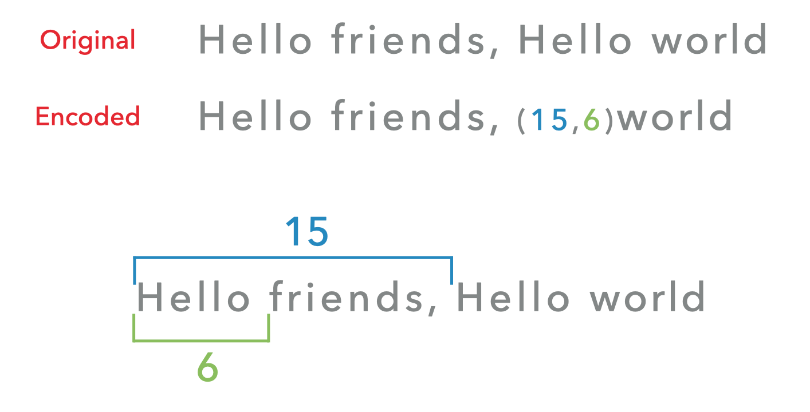
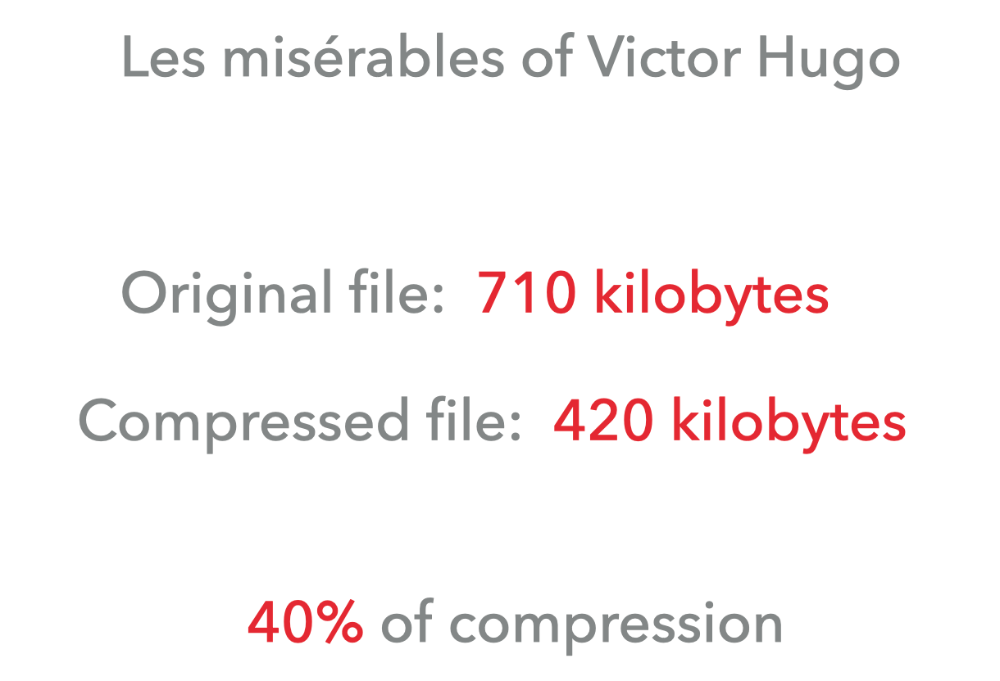
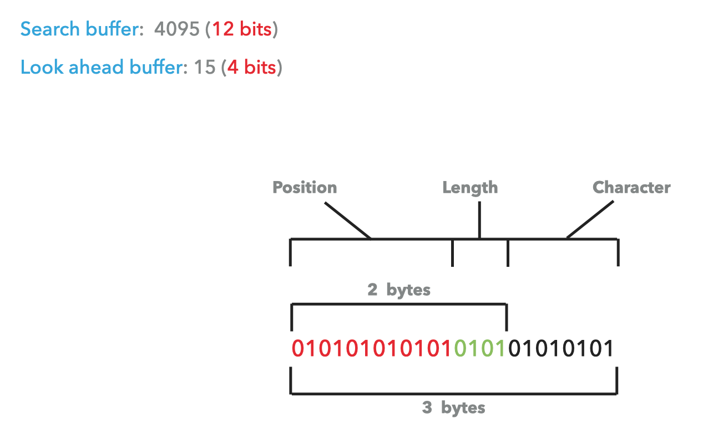

##  Contribution

You can contribute to the improvement of the documentation, by adding, modifying or deleting items.

## Definition
The [LZ77](https://en.wikipedia.org/wiki/LZ77_and_LZ78) algorithm is a [lossless compression](https://en.wikipedia.org/wiki/Lossless_compression) algorithm using a sliding window.


It can be found under different names such as Lempel Ziv 77 or LZ1.


* Lossless compression is a compression method that restores the same data as the original after decompression.
* A sliding window compression uses a search memory area that can move, this prevents the algorithm from being too resource-intensive.

<p align="left">
    
</p>

## Features

In the operation of the LZ77, there is a sliding window.


This sliding window is split into two parts, one part which is the buffer and one part which is the dictionary.


The buffer is the playback part.

The dictionary is the research part.

<p align="left">
    
</p>

The purpose of this algorithm is to encode a recurrence by the location already seen.

<p align="left">
    
</p>

## Process

The process is simple, find the largest pattern of the look ahead buffer in the search buffer.

```
in the search buffer = "AABBCC"
in the look ahead buffer = "RRYYIIAANNMMXX"
```

Let's start looking:

1. `AABBCC`

`NOT FOUND`

2. `AABBC`

`NOT FOUND`

3. `AABB`

`NOT FOUND`

4. `AAB`

`NOT FOUND`

5. `AA`

`FOUND` RRYYII<strong>AA</strong>NNMMXX


The distance from the found pattern to the playback buffer is calculated.

<strong>AA</strong>NNMMXX = 8

The length of the pattern found is `2`.

And the next pattern character in the buffer is `B`.

For encoding then `(8, 2, B)`.


If no pattern is found, the encoding will be like this `(0, 0, [first character of the buffer])`.

If no pattern is found in the previous example then `(0, 0, A)`.


To summarize, if a pattern is found `([distance], [size], [next character])` and if no pattern is found `(0, 0, [first character in buffer])`.

<p align="left">
    
</p>

On small data, the encoded part can be larger than the original data.

But on big data such as Victor Hugo's 'Les Misérables' (Volume 1):

* Original File: `710 kilobytes`

* Compressed file: `420 kilobytes`

Let `40%` compression.

<p align="left">
    
</p>

For binary representation, the values commonly used are:

* Search buffer: 12 bits or 4095.

* Look ahead buffer: 4 bits or 15.


Be encoded on 2 bytes.

<p align="left">
    
</p>

## Usage
The LZ77 is no longer used, the LZSS form will be preferred.

## Pseudo-Code
<p align="left">
    
</p>

<p align="left">
    
</p>

