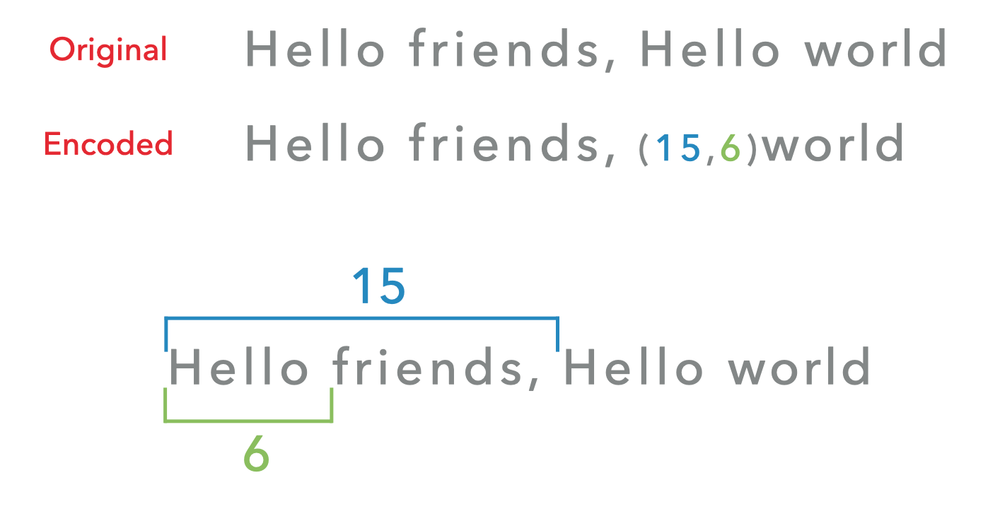
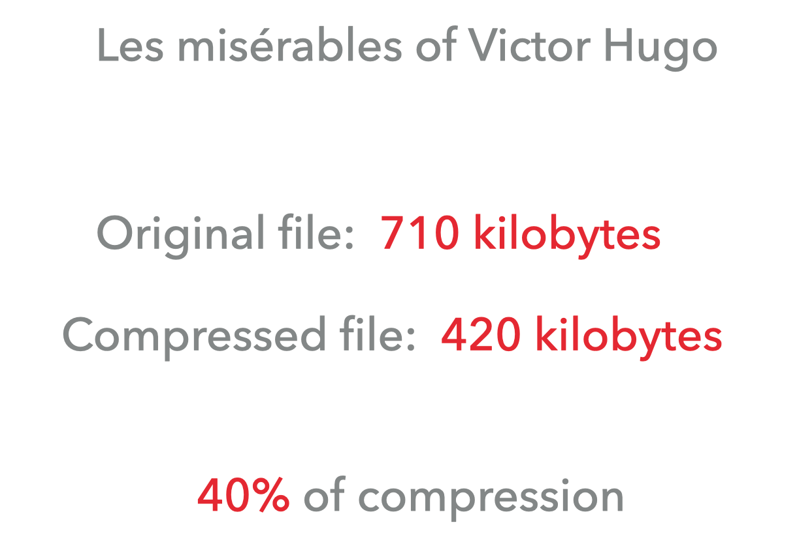
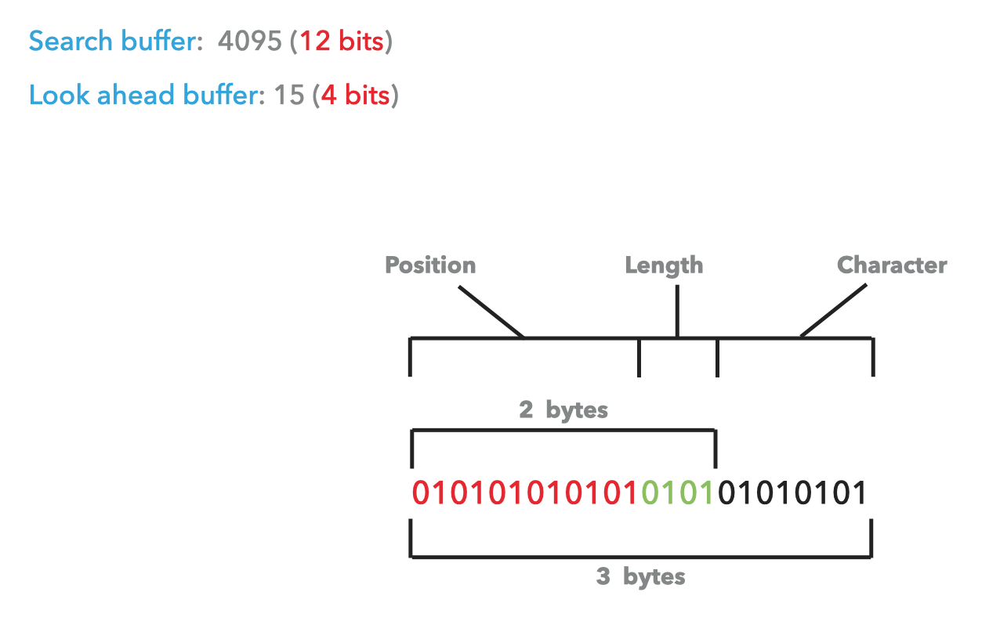
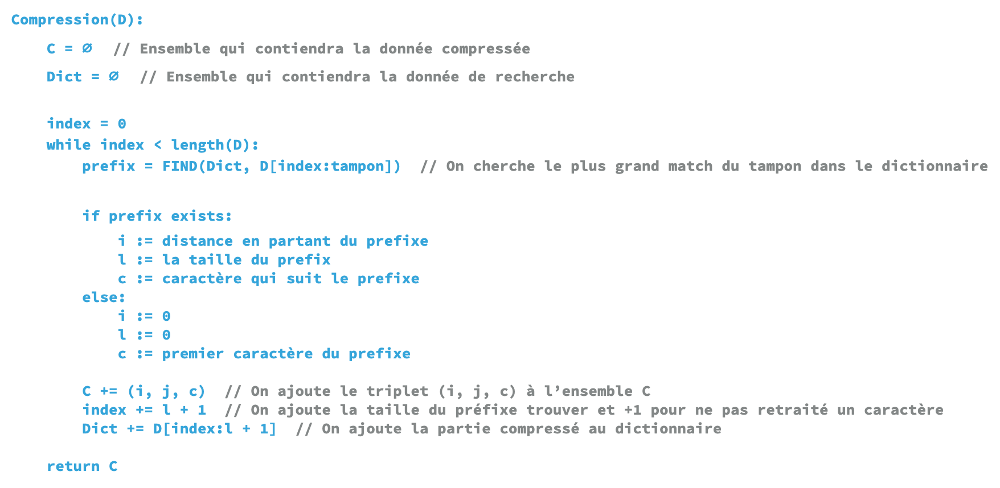
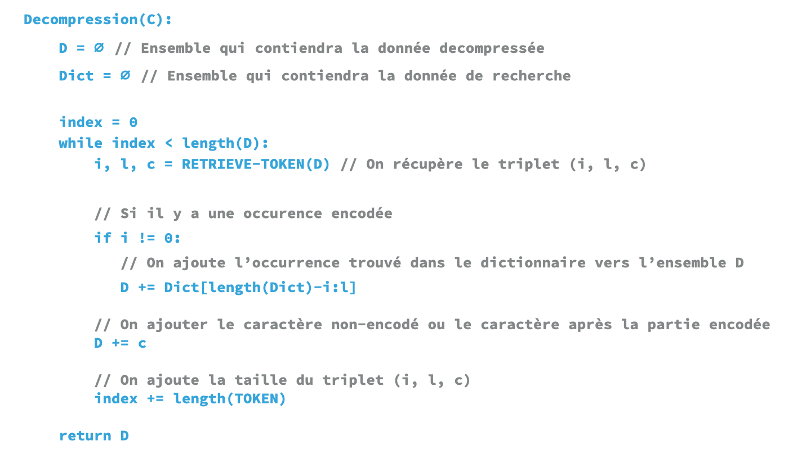

##  Contribution

Vous pouvez contribuer à l'amélioration de la documentation, en ajoutant, modifiant ou supprimant des éléments.

## Définition
L'algorithme [LZ77](https://fr.wikipedia.org/wiki/LZ77_et_LZ78) est un algorithme de [compression sans perte](https://fr.wikipedia.org/wiki/Algorithme_de_compression_sans_perte) utilisant une fenêtre glissante.


On peut le retrouver sous diffèrent nom comme Lempel Ziv 77 ou LZ1.


* Une compression sans perte est une méthode de compression qui restitue après la décompression la même donnée que l’original.
* Une compression par fenêtre glissante utilise une zone mémoire de recherche qui peut se mouvoir, cela évite à l'algorithme d'être trop gourmand en ressources.

<p align="left">
    
</p>

## Fonctionnalités

Comme on l'a vue précédemment, l’algorithme LZ77 utilise une fenêtre glissante comme l’a majorité des algorithmes de la famille LZ.

Cette fenêtre glissante est coupée en deux parties, une partie qui est le tampon et une autre qui le dictionnaire.

Le tampon est la partie lecture et le dictionnaire est la partie recherche.

<p align="left">
    
</p>

Le but de cet algorithme est d'encoder une récurrence par l'emplacement déjà vu.

<p align="left">
    
</p>

## Fonctionnement

Le fonctionnement est simple, trouver le plus grand motif du tampon dans le dictionnaire.

```
dans le tampon = "AABBCC"
dans le dictionnaire = "RRYYIIAANNMMXX"
```

On commence à chercher:

1. `AABBCC`

`NOT FOUND`

2. `AABBC`

`NOT FOUND`

3. `AABB`

`NOT FOUND`

4. `AAB`

`NOT FOUND`

5. `AA`

`FOUND` RRYYII<strong>AA</strong>NNMMXX


On calcule la distance du motif trouvé jusqu'au tampon de lecture.

<strong>AA</strong>NNMMXX = 8

La longueur du motif trouvé est 2 (`AA`) et le prochain caractère du motif dans le tampon est `B` alors pour l'encodage on obtient `(8, 2, B)`.


Si aucun motif est trouvé, l'encodage sera comme ça `(0, 0, [premier caractère du tampon])`, alors si aucun motif est trouvé dans l'exemple précédent, l’encodage sera `(0, 0, A)`.

Pour résumer, si on trouve un motif `([distance], [taille], [prochain caractère])` et si aucun motif est trouvé `(0, 0, [premier caractère du tampon])`


<p align="left">
    
</p>

Sur de la petite donnée, la partie encodée peut être plus grande que la donnée originale.

Mais sur de la grande donné comme `les misérables` de Victor Hugo (tome 1):

* Fichier original: `710 kilobytes`

* Fichier compressé: `420 kilobytes`

Soit `40%` de compression.

<p align="left">
    
</p>

Pour la représentation binaire, les valeurs communément utilisées sont:

* Dictionnaire: 12 bits soit 4095.

* Tampon: 4 bits soit 15.


Soit encodé sur 2 octets.

<p align="left">
    
</p>

## Utilisation
Le LZ77 n'est plus utilisée, la forme LZSS sera privilégié.

## Pseudo-Code


Voici un pseudo pour la partie compression:

<p align="left">
    
</p>


Et la partie décompression:


<p align="left">
    
</p>
